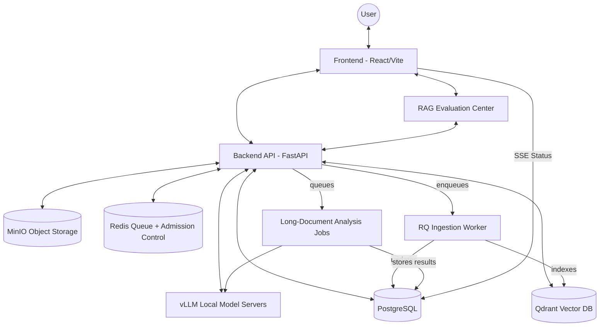

# BankAi: Technical Architecture

This document provides a deep dive into the architecture of the BankAi platform, focusing on high-fidelity features, data isolation, and the asynchronous document pipeline.

## 1. System Architecture Diagram

## 2. Component Breakdown

### 2.1 Frontend (React + Vite)
*   **State Management:** Uses React hooks for session, document, trust/citation state, and guided task workflows.
*   **Streaming Logic:** 
    *   Handles **Token Streaming** via fetch readable streams for real-time AI responses.
    *   Handles **Status Streaming** via `EventSource` (SSE) for document processing tracking.
*   **Trust UX:** Chat answers expose citation verification badges and an evidence panel with exact source passages.
*   **Evaluation UX:** `/evaluations` lets admin and audit roles run RAG test cases before demos, pilots, or ingestion/model changes.
*   **Design System:** Built with Tailwind CSS and Material Symbols for a restrained internal banking workspace.

### 2.2 Backend (FastAPI + SQLModel)
*   **API Design:** RESTful API for session management and file handling; SSE for long-running notifications.
*   **Asynchronous Tasks:** Uses Redis/RQ for durable document ingestion outside the API process.
*   **Long-Document Jobs:** Uses the same queue infrastructure for large PDF/OCR/XLS analysis, status polling, and persisted results.
*   **Guardrails:** Integrated PII detection and prompt injection protection layers.

### 2.3 RAG Pipeline (PostgreSQL FTS + Qdrant)
*   **Ingestion:**
    *   Text extraction for PDF, DOCX, XLSX/XLS, PPTX, TXT, CSV, and image-heavy uploads.
    *   OCR fallback up to configured page limits.
    *   Table-aware extraction through `pdfplumber` when available, plus Excel sheet/cell/merged-range metadata.
    *   Chunking (RecursiveCharacterTextSplitter).
    *   Embedding (Sentence-Transformers).
*   **Retrieval:**
    *   Hybrid retrieval uses Qdrant vector search plus PostgreSQL full-text search over document chunks.
    *   Every retrieval path is filtered by `bank_id`, document scope, session ownership, and role access.
    *   Sources are gated by `MIN_SOURCE_RELEVANCE_SCORE` before they are shown or used as evidence.
    *   Source payloads include document title, page, section/chunk, short snippet, and full passage for verification.
*   **Citation Verification:**
    *   Generated answers are compared against retrieved source passages.
    *   Verification metadata is returned to the UI so staff can distinguish grounded citations from weaker evidence.
*   **Evaluation:**
    *   Admins can run RAG evaluation cases through `/api/evaluations/rag`.
    *   The evaluator scores expected source recall, citation term recall, answer term recall, and expected not-found behavior.

## 3. Data Isolation & Security

### 3.1 Multi-Tenancy
Data is partitioned at the database and vector levels using `bank_id`. Every query is enforced with a `WHERE bank_id = :bank_id` constraint.

### 3.2 Session Isolation
Chat session documents are tagged with `document_scope = "session_upload"`. The RAG query engine ensures that session-specific uploads are only included in the search context if they match the current active `session_id`.

## 4. Document Processing Lifecycle

1.  **Selection:** User selects a file in the UI.
2.  **Upload:** Frontend POSTs to `/api/chat/sessions/{id}/files`.
3.  **Handoff:** API saves file to MinIO and enqueues ingestion in Redis/RQ.
4.  **OCR/Parsing:** Worker extracts text, tables, OCR output, and spreadsheet metadata where available.
5.  **Indexing:** Worker chunks text, generates embeddings, and upserts to Qdrant.
6.  **Streaming:** During steps 4-5, the worker updates the DB status, which is streamed to the UI.
7.  **Completion:** UI card turns "Ready", enabling context-aware chat.

---

## 5. Long-Document Analysis Lifecycle

1.  **Selection:** User opens a ready/indexed/approved document in Document Library.
2.  **Queue:** Frontend POSTs to `/api/long-document-analysis`.
3.  **Access Check:** Backend validates bank scope, role, document lifecycle, and user/job ownership.
4.  **Extraction:** Worker reuses the document extraction layer for PDF text/tables, OCR fallback, and Excel sheet/cell metadata.
5.  **Packing:** Relevant excerpts are selected within `LLM_DEEP_CONTEXT_WINDOW_TOKENS`.
6.  **Generation:** The analyst model produces a staff-reviewable result from selected excerpts only.
7.  **Review:** UI polls job status and displays completed results from PostgreSQL.

This path is for heavy files that should not block normal chat. It does not guarantee perfect OCR, table understanding, handwriting recognition, signature verification, or final business decisions.

---

## 6. Deployment Infrastructure

*   **Orchestration:** Docker Compose.
*   **Upgrade Safety:** `deploy/upgrade.sh` runs build/recreate/migrate/health gates and optional backend tests.
*   **Runtime Health:** Compose health checks cover Redis, backend, frontend, and nginx.
*   **Scaling:** The backend is stateless and can be scaled horizontally if Redis admission control is shared. Qdrant, PostgreSQL, MinIO, and Redis require real HA services for whole-bank deployments.
*   **LLM Performance:** Local inference runs through vLLM model servers with Redis-backed admission control. The repository supports separate fast, analyst, and vision/OCR routes; the current production profile routes all text lanes to the Gemma 4 26B endpoint and uses a separate Qwen3-VL endpoint for vision/OCR work.
*   **Worker Sizing:** Heavy OCR/PDF/XLS jobs consume ingestion-worker and deep-model capacity. Monitor Redis queue depth, job age, and GPU memory before raising concurrency.
