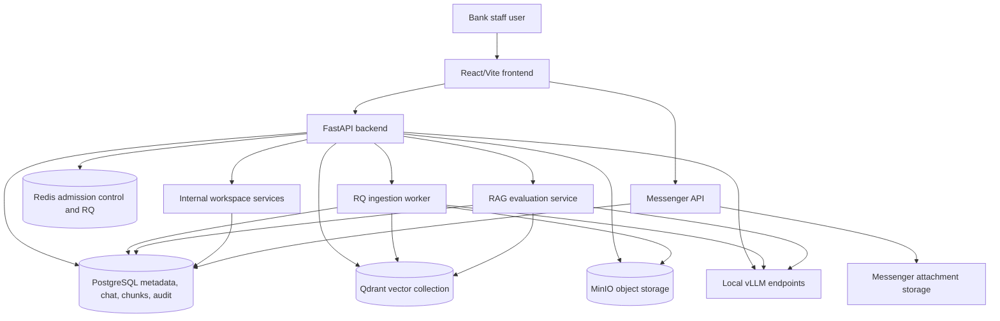

# LipiCore Architecture

LipiCore is a bank-scoped staff AI appliance built around strict document governance, source-backed retrieval, local model routing, and auditable usage. The system is intentionally not a generic SaaS chatbot: every useful answer path is tied to bank identity, user role, document lifecycle, source evidence, and operational readiness.

## System Diagram

## Main Components

| Component | Responsibility |
| --- | --- |
| Frontend | Staff workspace for chat, documents, OCR extraction, evaluations, Model Lab, analytics, users, audit logs, internal banking workspaces, compliance views, and messenger. |
| Backend API | Authentication, RBAC, chat orchestration, RAG, upload handoff, document governance, evaluations, analytics, audit, branding, feature flags, internal workspace APIs, and long-document job APIs. |
| Ingestion worker | Extracts files, repairs/OCRs text where needed, chunks content, extracts policy citation metadata, classifies source risk, embeds chunks, writes metadata, and indexes Qdrant. |
| PostgreSQL | Source of truth for users, banks, documents, chunks, chat history, long-document jobs, evaluations, audit logs, feature flags, employee profiles, notifications, CEO messages, staff work items, workflow cases, messenger data, and readiness metadata. |
| Qdrant | Vector retrieval for document chunks with bank, session, lifecycle, scope, and access metadata in payloads. |
| Redis | RQ queue backend plus model admission-control state for per-user and per-model concurrency. |
| MinIO | Object storage for uploaded knowledge files and extracted artifacts. |
| vLLM endpoints | OpenAI-compatible local model routes for staff chat, deeper analysis, and optional document-image/vision review. |

## Backend API Surface

Primary routes are mounted under `/api`:

- `/auth`: login, logout, current user.
- `/banks`, `/users`, `/config/branding`: tenant, user, and white-label administration.
- `/feature-flags`: per-bank feature controls for optional staff workspaces.
- `/chat`: sessions, messages, streaming, session uploads, model status.
- `/documents`: upload, status streaming, lifecycle, governance, citation backfill, source inspection, deletion.
- `/long-document-analysis`: queued large-file analysis jobs.
- `/evaluations/rag`: bank-specific RAG quality gate.
- `/analytics`: summary, appliance health, bank readiness.
- `/model-lab`: model candidate/status/benchmark summaries.
- `/employee-directory`: bank-scoped employee search.
- `/market-utilities`: local banking time, business date, and bank-published exchange-rate batches.
- `/notifications`: alerts, unread count, read state, and acknowledgement.
- `/ceo-messages`: executive announcements and acknowledgements.
- `/staff-work-items`: assigned work items for Daily Inbox.
- `/knowledge-gaps`, `/policy-changes`, `/audit-evidence`: knowledge governance and evidence workspaces.
- `/complaint-workspace`, `/circular-impact`, `/branch-responses`, `/kyc-case-prep`, `/checklist-workspace`: banking workflow case helpers.
- `/ocr/extract`: transient OCR/text extraction outside approved knowledge.
- `/audit`, `/export`: governance evidence.
- `/messenger`: staff messaging, conversations, attachments, read state, pins.

## Internal Banking Workspace

Internal banking workspace modules are optional, bank-scoped tools that sit around the AI assistant. They include Employee Search, Staff Inbox, CEO's Message, Notifications & Alerts, Forex/Time/Dates, knowledge-gap tracking, policy-change watch, audit evidence packs, and banking workflow helpers.

All new workspace features default off. The frontend hides disabled routes through feature gates, and backend services enforce the same flags before returning data. Super Admin can enable or disable a feature per bank; non-Super Admin users cannot change flags or read another bank's workspace data.

See [internal-banking-workspace.md](internal-banking-workspace.md).

## Chat Flow

1. The user submits a message in a bank-scoped session.
2. The backend validates the session owner, user bank, role, rate limit, and prompt-injection policy.
3. PII masking redacts detected sensitive values before model processing.
4. The user message is stored in PostgreSQL.
5. Recent history is used to rewrite short follow-up questions into standalone retrieval queries.
6. If the mode or selected documents require sources, the query is embedded with `BAAI/bge-m3`.
7. Retrieval searches selected session uploads first, then approved global knowledge when allowed.
8. PostgreSQL full-text candidates and Qdrant vector candidates are merged and reranked.
9. Document visibility is checked again against bank, session, scope, status, version state, department, and access level.
10. The prompt is built with untrusted document-context boundaries and source metadata.
11. Redis admission control reserves model capacity before calling vLLM.
12. The response streams back to the browser.
13. Policy-like answers are checked for required citation metadata: PDF page, document heading, and clause number. If required fields are missing, LipiCore returns a citation-incomplete review response instead of final policy advice.
14. Citation verification compares the answer with retrieved passages.
15. The assistant message, sources, trust metadata, session summary, and audit event are persisted.

If a source-required workflow has no usable source above the relevance threshold, the answer is the configured not-found response instead of general policy advice.

## Memory Model

LipiCore separates conversation memory from retrieval memory.

### Short-Term Memory

- Chat messages are stored in PostgreSQL as they are sent.
- The retrieval rewrite step loads up to 20 messages from the current session and uses recent turns to normalize follow-up questions such as "what about this?" or "show exact source".
- The model prompt receives the last 10 messages at most.
- `prepare_vllm_payload_messages` trims older messages when the selected model context window would be exceeded.
- Session summaries are lightweight metadata: the latest user question and assistant answer are truncated and stored for session list/context display.

### Long-Term Memory

- Long-term institutional memory is the approved document library, not raw chat history.
- Extracted chunks are stored in PostgreSQL and Qdrant with document, bank, lifecycle, session, permission, page, section, extraction-confidence, and source-risk metadata.
- Chat history remains auditable but is not currently re-indexed as reusable knowledge.
- Messenger messages and attachments remain in the messenger subsystem and are not indexed into RAG.

## Document Ingestion Flow

1. A user uploads a file through chat or Document Library.
2. The API stores the original file in MinIO and a `document` row in PostgreSQL.
3. A Redis/RQ job is enqueued.
4. The worker extracts content:
   - direct text from supported documents;
   - PDF text and tables through direct parsers and `pdfplumber` where available;
   - Tesseract OCR fallback for scanned pages;
   - legacy Nepali text-layer repair when direct extraction is corrupted;
   - Excel sheet, cell, merged-range, table, formula, and cached-value metadata;
   - presentation slide text and labels.
5. The worker selects an adaptive chunk profile.
6. Each chunk is classified for source-risk flags such as prompt-injection-like content.
7. Policy-like chunks extract citation metadata: PDF page, printed page when present, document heading, clause number, citation confidence, and incomplete reasons.
8. Chunks are embedded, written to PostgreSQL, and upserted to Qdrant with citation and governance payload metadata.
9. Document status progresses through queued, extracting, chunking, embedding, indexed/ready, approved, disabled, or failed states.

## Chunking Defaults

| Profile | Use Case | Size | Overlap |
| --- | --- | ---: | ---: |
| `default_text` | general text | 1000 chars | 200 chars |
| `regulatory_section` | policies, procedures, circulars, dense section markers | 900 chars | 180 chars |
| `spreadsheet_table` | CSV/XLS/XLSX table-heavy extraction | 1600 chars | 120 chars |
| `presentation_slide` | PPT/PPTX slide text | 900 chars | 120 chars |
| `ocr_compact` | images, scanned pages, OCR-confidence-bearing pages | 800 chars | 100 chars |

The splitter uses character length, not token length. Changing chunk size or embedding dimension requires rerunning evaluations and usually rebuilding or creating a new Qdrant collection.

## Retrieval And Trust

The retrieval layer uses multiple gates:

- Qdrant query filter always includes `bank_id`.
- Session uploads require matching `session_id` and `document_scope=session_upload`.
- Approved knowledge requires `document_scope=global_knowledge`, approved status, and approved version state.
- Staff users cannot see higher-access or unrelated department documents.
- Disabled, archived, superseded, and failed documents are excluded from normal retrieval.
- Sources below `MIN_SOURCE_RELEVANCE_SCORE=0.4` are not exposed as evidence.
- The model prompt warns that retrieved documents are untrusted evidence and must not override system, developer, safety, source, or refusal requirements.
- Source payloads include `page_number`, `pdf_page_number`, `printed_page_number`, `document_heading`, `clause_number`, citation confidence, citation completeness, effective dates, lifecycle status, and source-risk metadata where available.
- Policy, procedure, circular, directive, SOP, law, act, and compliance answers require PDF page, document heading, and clause number. Missing required fields produce `citation_incomplete` metadata and a review response.
- Citation verification and source-risk metadata are returned to the UI for staff review.
- Existing approved documents can be updated with `POST /api/documents/{document_id}/citation-backfill`, which re-extracts citation metadata for stored chunks and updates scoped Qdrant payloads best-effort.

## Long-Document Analysis

Long-document analysis is the background path for large PDFs, scanned files, and detailed Excel/PDF review. It reuses extraction, packs relevant excerpts within the deep-model context budget, runs a source-backed analyst prompt, and stores results in PostgreSQL. It is intentionally separate from interactive chat so heavy files do not block normal staff questions.

See [long-document-analysis.md](long-document-analysis.md).

## Evaluation And Readiness

RAG quality is tested through `/api/evaluations/rag` and the frontend `/evaluations` workflow. Evaluation cases check expected source recall, citation term recall, answer term recall, location recall, not-found behavior, and no-general-policy-advice behavior. Location recall can include expected PDF pages, printed pages, document headings, and clause numbers.

Operational readiness combines:

- document status and approval coverage;
- ingestion queue and worker state;
- model health and queue pressure;
- RAG evaluation results;
- backup/restore evidence;
- Qdrant snapshot evidence;
- representative upload tests;
- rollback readiness.

See [evaluations/README.md](evaluations/README.md) and [deployment/bank-readiness-checklist.md](deployment/bank-readiness-checklist.md).

## Deployment Shape

The default stack is single-host Docker Compose for pilots:

- `backend`
- `frontend`
- `nginx`
- `db`
- `qdrant`
- `redis`
- `minio`
- `ingestion-worker`
- `messenger-backend`
- `vllm-b`, `vllm-c`, and optional `vllm-vision`

Single-host Compose is not a whole-bank HA architecture. Whole-bank deployments need HA data services, restore drills, model redundancy, monitoring, queue alerts, and tested rollback procedures.

## Current Limits

- Citation verification is a two-stage process: lexical overlap precheck plus configurable semantic matching. It is stronger than raw lexical overlap but not a formal legal entailment system unless the optional NLI verifier is explicitly enabled.
- OCR quality depends on source scan quality, language packs, page layout, and installed OCR tooling.
- Complex tables, handwriting, signatures, stamps, seals, and chart-heavy documents still require staff review.
- Large-file analysis is queued and capacity-bound; it does not guarantee instant turnaround.
- Retrieval quality must be proven per bank with that bank's approved documents.
- Current chat history is not a long-term knowledge base.
- Feature-flagged workspace helpers create staff-reviewable records and drafts; they are not autonomous banking workflow approval systems.
